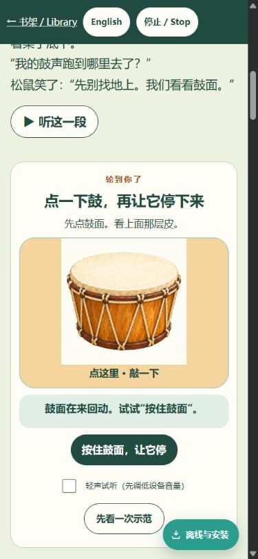
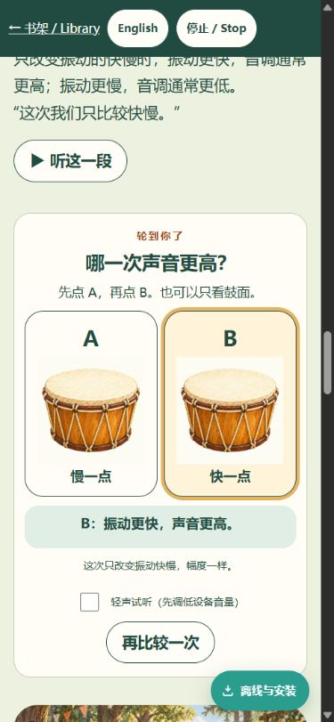
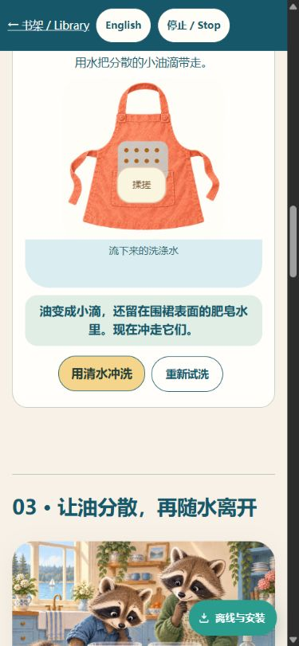
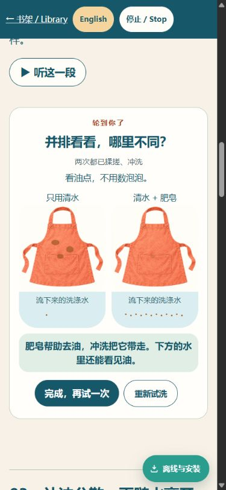
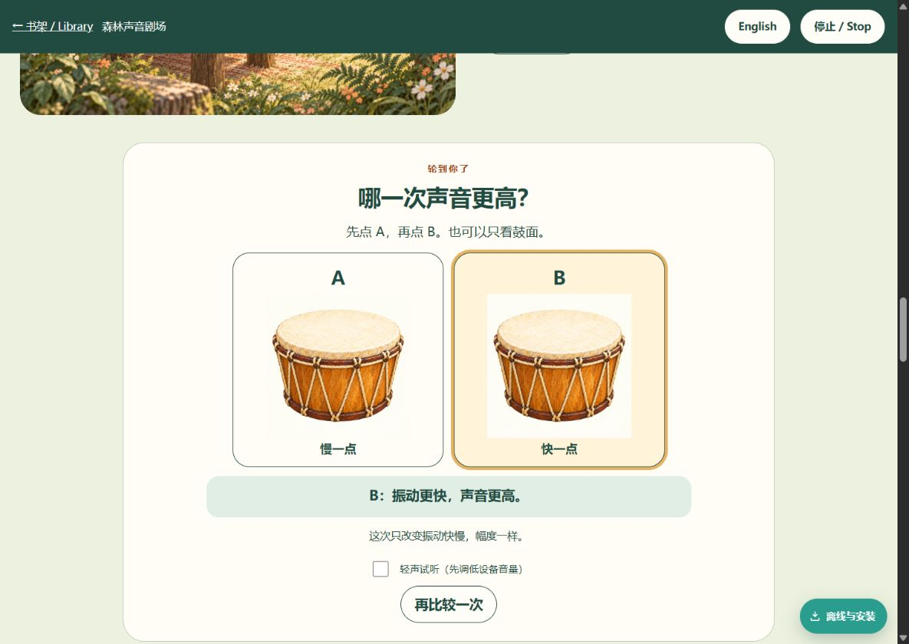
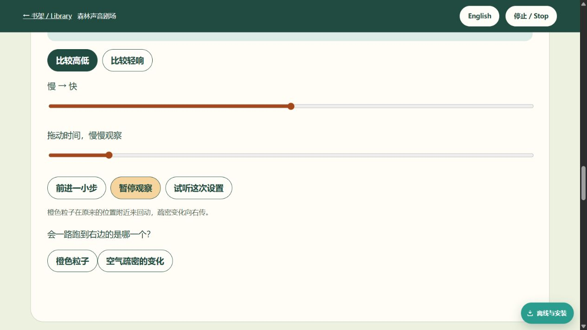
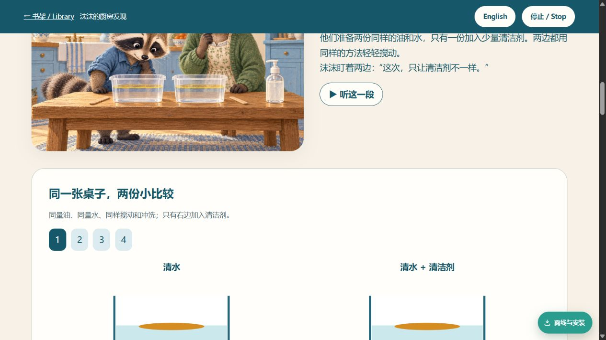
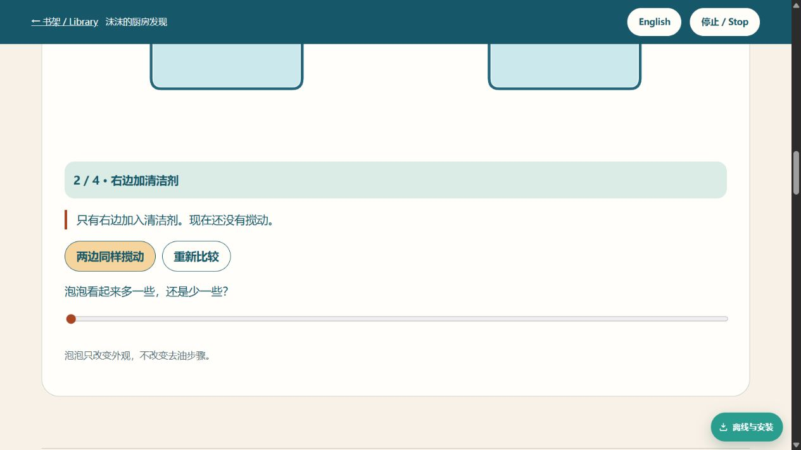
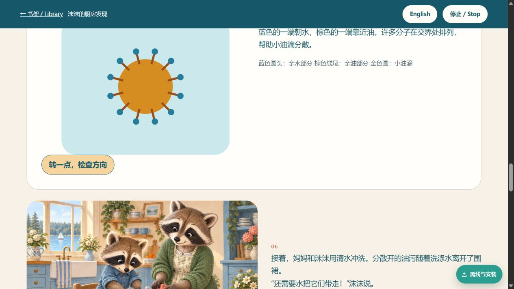

# Interaction redesign audit

Current production captured through Codex in-app browser on 2026-09-20. Baseline main 92ff2c27e1e15ba0479bfa9e1bb8a96900890a96. The screenshots below were captured, saved and reopened during this audit, not reused from prior QA.

1. **Sound comparison — needs redesign.** `01-sound-controls.png`: after activating continuous observation, both sliders, mode buttons and quiz are visible, but the air-particle model is above the viewport. The child cannot see the result while choosing the action. There are multiple equally weighted actions, and the listener must understand rate/amplitude/time before exploring. Large buttons and explicit sound opt-in are strengths to preserve.
2. **Soap entry — needs redesign.** `02-soap-start.png`: story apron becomes oil in containers. Four bare numbered badges do not explain the next action. The illustration, comparison labels and first instruction consume the viewport before the control appears. A child having difficulty mapping the container to the apron is a hypothesis grounded in this visual discontinuity, not a tested child finding.
3. **Soap action — needs redesign.** `03-soap-action.png`: adding detergent changes the text and unlocks a foam slider, while the changing oil area is above the viewport. Foam is foregrounded before cleaning is completed despite not being the learning goal. A stable next-step button and reset are useful foundations.
4. **Molecule rotation — needs redesign.** `04-soap-molecule.png`: pressing rotate turns a symmetric diagram but produces no new textual observation, choice, goal, or completion. The diagram requires reading a separate legend; decorative manipulation is not evidence of understanding.

## Implementation brief

- Preserve published story text and approved bilingual audio, colors and character art. No shared/PWA edits by content task. Isolated worktree `interaction-redesign`.
- One compact, bounded observation stage per question. A primary action appears adjacent to the visible object; action updates picture and one short result. Do not require reading technical labels to begin.
- Sound: direct drum tap with localized head motion, explicit stop, a replayable example. Pitch and loudness become two separate two-choice experiments with fixed other parameter, short non-overlapping tones, visible A/B difference even muted. Propagation becomes a short step sequence; optional closer view preserves local oscillation rather than moving one particle into an ear. Ear terms progressively reveal, not six equal navigation choices.
- Soap: same apron/soil view through plain water, detergent, rubbing, rinse; show water-only reference at completion, retain visible removed oil in wash water. Optional molecular close-up first demonstrates orientation; no rotation task. Foam question is after the cleaning sequence, not a competing slider.
- Keyboard/touch buttons, clear replay/reset/next, reduced-motion still frames and text. Stop cancels all pending sound and visual work, including late audio context resume.
- Added interaction copy is versioned separately and not automatically narrated; unchanged story/audio contracts remain authoritative. No full-screen temporary device narration masquerading as new production audio.

## Evidence limits

This is an adult expert review of actual production interaction and screenshots. No 4–8-year-old comprehension study, screen-reader audit or physical touchscreen test has taken place. Final candidate needs separate QA and user review; this round is not authorized for production publication.

## Candidate v2 self-check

- Browser preview: http://127.0.0.1:63412/books/sound/#tap-lab and http://127.0.0.1:63412/books/soap/#wash-lab. Port 63411 had an older service-worker snapshot, so corrected CSS/copy was verified on a fresh origin.
- Sound: tap/hold leaves a persistent stopped result; natural decay allows 3.2 seconds to find Hold. Pitch A/B was exercised at mobile and desktop widths, with separate loudness activity. Default remains silent.
- Soap: exercised water-only, matched fresh soil plus soap, rub, rinse, final comparison and language switch. Rubbing shows drops in a blue water film on the apron; rinse leaves drops in the water below. Enter activated rinse; Tab moved to the reset button.
- At 320px viewport, English pages both had document clientWidth=scrollWidth=305 (scrollbar consumes 15px): no horizontal document overflow. Screenshots also inspected at 390x844 and 1200x850. These are simulated viewport checks, not physical devices.
- Fixed QA findings: primary button hover/focus contrast; explicit distinction between soapy water on the apron and drained water below. Independent lifecycle/offline checks are reported separately by QA.
- `node --check` passed for both new interaction modules; `node tests/qa_sound_soap_models.cjs` passed. Story JSON and existing formal audio were not edited. New UI instructions are bilingual text, not newly recorded narration.

### New artwork provenance

Generated with ImageGen on 2026-09-20 and visually inspected, then encoded to WebP using `tools/encode_everyday_art.py`.

- `books/sound/images/drum-lab.webp`: source `exec-2e9a23a2-fe5f-4f7d-b80a-7764b7956b83.png`; prompt brief: isolated ochre rope-laced story drum, slightly elevated front view, unobscured cream drumhead, ivory background, no text or characters; referenced existing drum close-up. Only the drumhead region is animated, clipped to the inspected head coordinates.
- `books/soap/images/apron-lab.webp`: source `exec-e54f5a71-ba0b-4a7b-b79a-6bf2f83071f3.png`; prompt brief: matching coral apron laid flat, visible neck loop, ties and pocket, clean central cloth, ivory background, no text or stains; referenced existing helper illustration. Controlled soil and water are separate SVG layers within the cloth, not over a story character.

### Candidate screenshots

### Review steps

1. Sound: tap the drum, hold to stop; try A and B in each separate comparison. Sound is optional.
2. Soap: use water, reset matched soil and add soap, rub, then rinse; compare the two aprons and the oil in the water below.
3. Open optional closer views only after the main action. Switch English/Chinese or reset to repeat.

