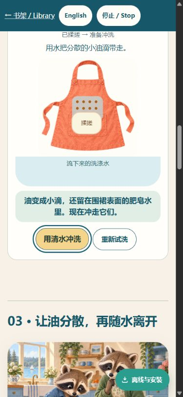
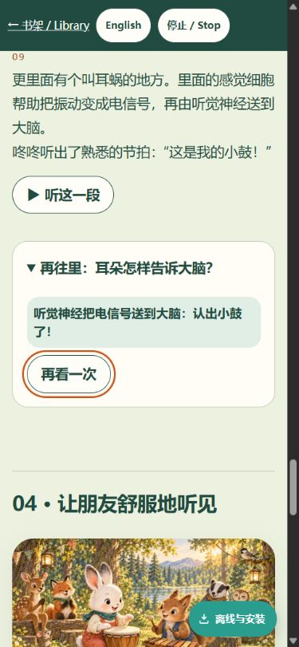
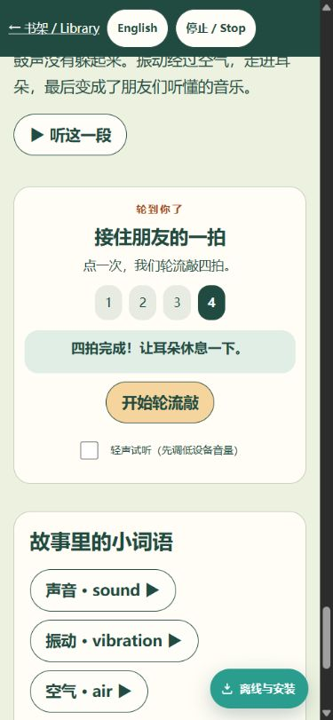

# 交互重设计：独立本地回归

> 历史候选报告：后续透明鼓与真实采样已替换原音效。本报告不作为当前音效验收；当前结果见 `real-drum-local-qa.md`。

日期：2026-09-20。工作树 interaction-redesign，基线 main 92ff2c27，候选 PWA 指纹 **cdf6d72d4707**。结论：本轮发现的两项阻断已修正并复验，可以交用户体验候选；没有生产发布。

## 逐步交互审视

1. 敲鼓 → 按住停止：通过。静音有持久状态，物体、动作和结果可同屏；自然结束后停止按钮禁用，可再次敲鼓。
2. 传播逐站 → 从头开始：通过。每次只推进一站，显示当前解释；可选粒子细节与主流程分开。
3. 高低 A/B：通过。图、A/B操作、结论同屏；比较时幅度固定。
4. 轻响 A/B：通过。与高低独立，比较时频率固定。
5. 可选耳内接力：通过。键盘展开、逐站推进到大脑、出现再看一次入口。
6. 四拍示范：通过。显示1–4拍及完成/休息提示；这是一次点击触发的示范，不是儿童逐拍输入测试。
7. 清水试洗：通过。明确保留清水结果，下一步从相同初始油点重新比较。
8. 加肥皂 → 揉搓：通过修正复验。浅蓝层表示围裙表面的肥皂水，文字明确尚待冲洗；主按钮浅金底深色字、可见键盘焦点。
9. 冲洗 → 并排结果 → 重置：通过。下方水中可见油滴，两次结果同屏，重置恢复初始状态。
10. 可选油滴放大镜：通过本轮操作。可展开、示范；切语言清除待执行定时器。
11. 泡泡问题答错 → 重试：通过。答错提供油点线索，正确回答后有明确反馈。

## 自动回归证据

- `tests/qa_interaction_redesign.cjs`：11组通过。浏览器触摸事件模拟、Enter操作、自然结束、停止、切语言、朗读互斥、离开页面立即停止振荡器、延迟AudioContext.resume取消、减弱动效、答错重试、重置、新图断网加载。
- `tests/qa_sound_soap_browser.cjs`：320/390/820/1024/1280五宽、中英双语无横向溢出；故事图加载、场景顺序、A/B参数独立通过。旧滑块选择器已替换，不用旧DOM约束新版。
- 专项390×844、844×390、1024×768检查：无横向溢出，可见互动按钮至少44px。未据此声称所有屏幕都能完整同屏容纳全部内容。
- `tests/qa_everyday_full.cjs`：**66在线 + 66离线**原生MP3播放全部完成，无浏览器错误；4倍速不跳播；缓存音频hash一致、部分包升级、删单本/重下载及其它下载保留检查通过。先前运行在旧截图选择器处失败，修正后已从头完整重跑通过。
- `tests/qa_installed_pwa_upgrade.cjs`：历史旧安装场景恢复正常，旧飞机绘本115资源逐字节保留；候选两书下载和4段双语离线播放通过。此测试基于历史87b7b879客户端，不等于在用户实体设备上实测。
- 9个Python测试、5个PWA单元/离线URL契约测试、音频交付合同、声音/肥皂模型合同通过。
- 静态PWA QA：6项通过、0失败；18本资源清单对齐。sound48项/soap47项，均包含新增互动JS/CSS/图片。

## 本任务修改范围

`tools/story_resources.py`及其测试：从实际入口引用脚本发现静态互动图片，缺图失败、未加载脚本不误收。生成`pwa-assets.js`与`sw.js`的同步版本引用。适配两份旧浏览器测试，新增专项浏览器测试并接入本地工作流文件。故事JSON、音频manifest和66个正式MP3未改；无需重新配音。

详细机器报告：`.qa-labs/interaction-redesign/report.json`、`.qa-labs/everyday-full/report.json`、`.qa-labs/installed-upgrade/report.json`（忽略目录，仅本机证据）。

## 边界与下一步

Product Design审视技能要求以当前实操/截图为依据，促成文图一致性和按钮对比度修正。已确认上述行为，不代表儿童能独立理解的用户研究结论。触摸、尺寸和standalone为浏览器模拟；未测实体手机/平板、屏幕阅读器完整流程或系统后台恢复。没有独立真人听感复评。浮动离线按钮在某些滚动位置仍可能遮到非主要说明，可继续体验评估。

代码和工作流仅本地修改，未提交、推送、合并或发布，也没有运行远端CI。请用户看过本地候选后再决定是否发布。
