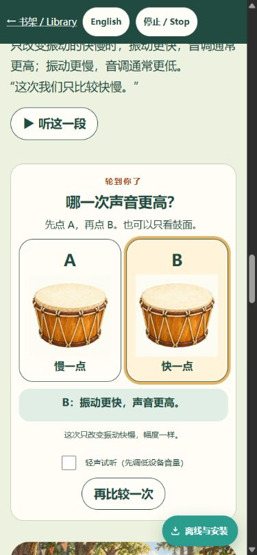
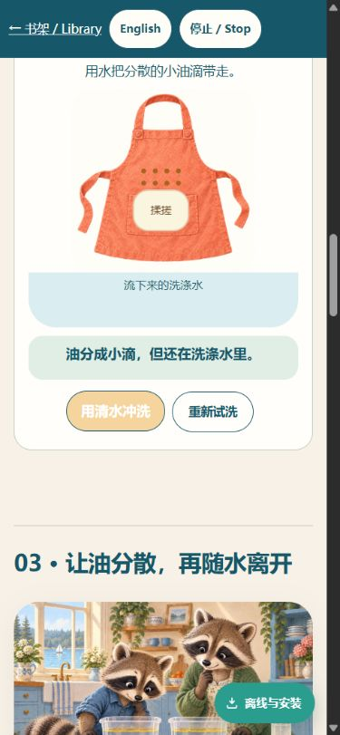
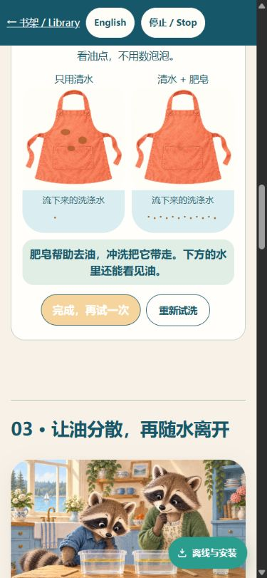

# 独立交互审视：第一轮候选

2026-09-20。本地 127.0.0.1:63411，基线 main 92ff2c27，未提交的 interaction-redesign 候选。使用 Product Design audit 的先操作截图、再判断方法。窄屏设置390×844；浏览器截图实际输出375×811，属于模拟窄屏，不是真手机/真实触摸，也不是儿童用户测试。

## 已实际操作的步骤

1. 敲鼓：通过。图、操作提示与动态结果可同屏，静音仍显示“鼓面在来回动”。
2. 按住停止：通过。结果保留“停住了”，可以再敲；在面板合理滚动位置无需追找结果。
3. 高低 A/B：通过本轮最小可理解性检查。A/B形象、标签、结果同屏，键盘/音频安全尚待完整回归。
4. 清水揉搓冲洗：流程可操作，保留油点结果；主按钮浅黄背景白字需修。
5. 同样油点加肥皂：通过，提示清楚区分第二次比较。
6. 揉搓：需修。文字称小滴在洗涤水里，但图只在围裙上标小滴，下方标为“流下来的洗涤水”的区域为空。需要文图明确分清表面清洁液与流出的水。
7. 清水冲洗：通过流程。并排清水/肥皂结果，洗涤水中看得见油点；按钮焦点颜色仍需修。
8. 重新试洗：通过，回到初始提示和油点。

## 集成改动与验证

本任务只改 tools/story_resources.py 和 tests/test_everyday_resources.py，不改书内实现。实际入口加载的本地脚本中，静态 images/*.webp 现在纳入离线发现；缺文件会报错，未引用草稿脚本不影响清单。已发现新 drum-lab.webp / apron-lab.webp。3个资源发现测试、5个PWA升级/离线URL契约测试和两份互动JS语法检查通过。

尚未生成最终 pwa-assets.js / sw.js 指纹：内容任务仍在调整，待候选冻结再生成并真实断网验证。未验证完整传播、轻响、耳内接力、合奏、减弱动效、真实触摸、完整键盘、朗读切换清理、油滴放大镜、答错恢复和旧安装升级。不把本轮部分流程通过表述为完整验收。

两项问题已交内容任务处理。所有改动只在本地，无新增推送、合并或发布。
