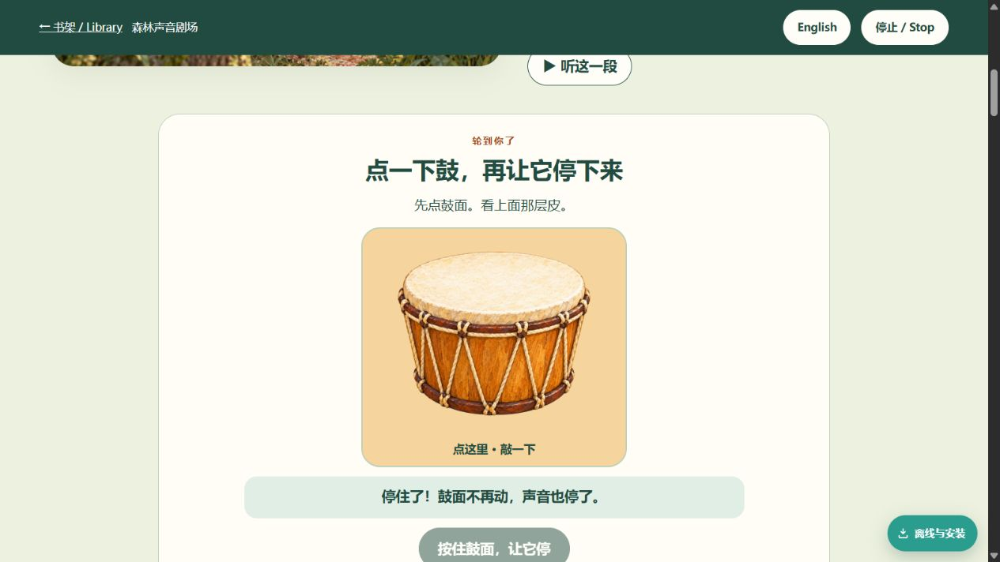

# 透明鼓与真实采样：本地验收

2026-09-21。最终本地PWA版本 **5abde007feec**，sound50项、soap47项。未提交、推送、合并或发布。

本地预览：http://127.0.0.1:63414/books/sound/ （内容任务保持服务器，避开旧63412缓存）。已在该页面操作轻声试听和自动停止示范，看到明确停止状态；预览标签保留供用户体验。

## 素材与实际页面

- 透明鼓1254×1254 RGBA，alpha范围0..255、四角0；实际金色选中卡没有白矩形，截图已保存并核验。
- 冻结的两份WAV均48kHz单声道PCM16、60176帧、1.253666667秒。磁盘与下载缓存SHA256均符合音频任务的认可锁定：low `6fac1c2921d0aac2a6926155649b8acc9ea7af8bce2b7c8ce630b4ebd3e915b6`；high `f522cd30c605a18736ac8090ff4fc0c6e3c92c65d066707f9bc9bf136d737f7c`。
- 音频任务已转达用户对这两份素材试听回复“可以”。此处不要求重复认可同一素材，也不把素材认可扩大为页面或发布授权。
- 成人笔记已改为实际鼓录音及处理说明，不再声称“合成纯音”。主体故事、manifest和66个朗读MP3未改。

## 回归结果

最终5abde007feec的 `qa_interaction_redesign.cjs` **16组通过、0页面错误**：

1. 两个SFX下载后缓存字节hash一致。
2. 触摸模拟敲鼓、按住与键盘触发；自然结束后的状态恢复。
3. 高低和轻响分开A/B；等待真实完成状态，不再固定等1350ms。
4. 原生AudioBufferSource按实际1.2536667秒自然结束。
5. 自动示范能提前淡出停止已开始的采样。
6. 连续选择替换旧声源，淡出后仅一个声源；轻响使用同一low文件；无纯音声源。
7. 传播逐站与重置。
8. 停止、切语言、朗读和音效互斥。
9. 页面离开时将BufferSource安排在15ms内停止（状态立即清空；实现12ms淡出），不再断言旧oscillator的无参stop。
10. 肥皂离线完整试洗与键盘重置。
11. 答错提示与重试。
12. 油滴示范定时器随切语言取消。
13. 延迟resume、fetch、decode各自遇停止/切语言：6种情况下都没有迟到声源。
14. 缺失采样显示不可用并保留视觉体验，不创建oscillator。
15. 减弱动效模式保留静态反馈。
16. 390竖屏、844横屏、1024平板无水平溢出，可见互动按钮至少44px。

另外：五宽双语/场景顺序/插图/A-B参数独立通过；最终版本的历史安装升级通过，旧飞机115资源保留；静态PWA6项0失败，18书资源对齐，9个Python测试和66音频字节交付合同通过。

全部朗读重跑 **66在线+66离线通过**，含原生MP3完成、音效互斥、缓存hash、部分包升级、删除单书/重下载、其它下载保留。该长测试启动时清单快照为0783744d56aa；随后仅成人说明文字更正导致最终版本5abde007feec，未变更已测采样播放逻辑或音频字节。最终版本另已重跑16组专项、布局、静态清单和旧安装升级。

机器证据：`.qa-labs/interaction-redesign/report.json`（最终版本与SFX hash）、`.qa-labs/installed-upgrade/report.json`、`.qa-labs/everyday-full/report.json`。测试中的网络/decode故障与延迟由测试注入；正常/离线播放使用真实浏览器解码和原生声源。

## 范围

本任务补充sfx/*.wav离线发现与缺失测试，生成新清单/worker版本，适配BufferSource回归；未修改音频字节或书内实现。沿用Product Design先截图后判断的审视方法。

未声称实体手机、真实儿童可理解性研究、扬声器现场响度测量或完整无障碍认证。仍须用户在页面里确认交互体验，再决定是否发布；既有发布授权不沿用。
